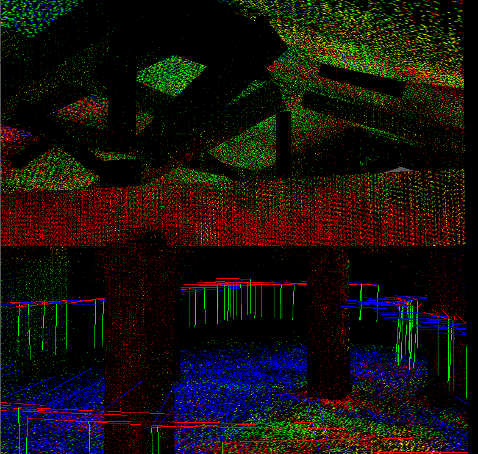
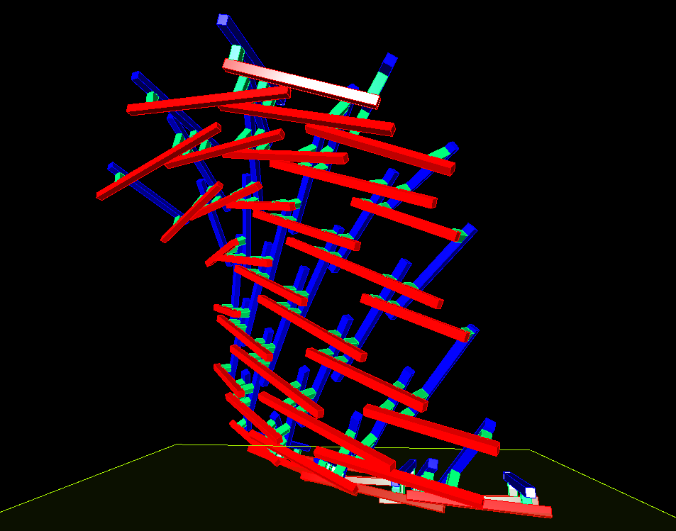
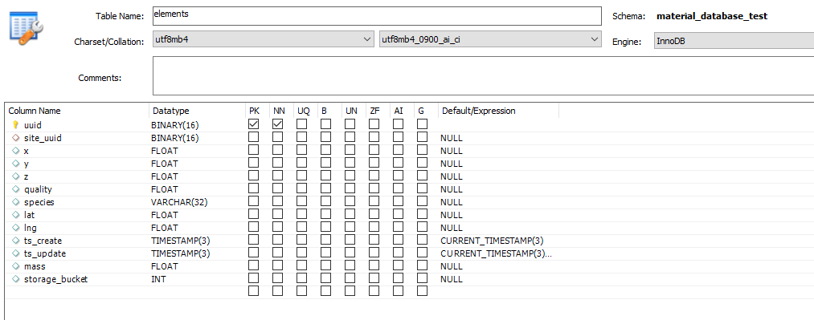

Mattersite
==========

This repo contains a set of tools from the research stage of the Mattersite project. For an overview of the project's goals and development, please see our [blogpost](http://www.iaacblog.com/programs/matter-site-2/). This technology primarily covers two phases, predemolition analysis, and post-demolition design with recovered materials. 

---

Pre-Demolition Analysis
-----------------------

### Components
Predemolition Analysis covers two main stages; 2d material localization for captured images, and 3d site reconstruction and assocation with localized material maps.

### Requirements
#### Material Localization
This system was tested under Ubuntu 18.04, with Python 3.8, primarily using OpenCV 4.2 and Numpy 1.18  
Full python environment is listed in requirements.txt  
Some util scripts also require Processing 3.
#### Geometric Reconstruction : Grasshopper Plugins
- Volvox : Point cloud processing
- Slingshot : MySQL connections
- Human : Interface
- Pufferfish : Geometry utilities
- Firefly : Batch processing
- Heteroptera : Batch Processing
- Owl : Bulk data processing
- Telepathy : Interface

CloudCompare was used for initial Point Cloud processing.  
Initial cloud creation was tested with Agisoft Metashape.

### Usage
#### Material Localization
##### Setup

To process the input images and train the classifier, run

`./setup_model`

The script will look for input images in the training_dataset directory, organized in directories by category name.

This may take ~30 minutes to run, mostly due to sampling the database during the feature clustering step.

This will produce several files in the 'model/' folder: 

- **hs-db.hdf5** : Averaged hue and saturation histograms for each category of the input dataset
- **features.hdf5** : Raw list of all features detected in input set
- **bovw.hdf5** : Results of clusterization of image features
- **vocab.cpickle** : Association of visual words with categories
- **model.cpickle** : Classification model trained from above results
- **idf.cpickle** : Inverse Document Frequency information, contains weighting information for the importance of different features. 
- **model_lbp** : Model trained for Local Binary Pattern analysis
- **model_hs** : Model trained on Hue/Saturation Histograms
- **model_stack** : Stack model combining other models in the system. 

##### Localization

To perform material localization, run 

`./localize`
 
The first argument to the script is the project directory to analyze in the 'pipeline' directory. 

The time to process each image depends on the kernel_size and thus patch_size variables in the localization script. Each classification window at minimum 100 pixels, so the patch size is determined by dividing 100 by the kernel size. (e.g. the default kernel_size is 4, which leads to a final resolution of classification patches 25px on a side)

This will write images with category colors overlayed to the localization_overlay directory of the associated pipeline directory. 

#### Geometric Reconstruction
Starting with a raw point cloud of the site, load the cloud into Cloud Compare. Run the RANSAC utility, looking for planes and cylinders. Once finished, select all found subclouds and export in xyz format. 
In the site_reconstruction script, select these filepaths in the 'Load Plane Clouds' and 'Load Cylinder Clouds' groups. From here, all reconstruction takes place automatically without user input necessary. This includes the assembly of SQL commands to add the extracted elements to the database. To actually upload, set the toggle in the 'Add to Database' group to True. 

#### Integration
When using agisoft metashape, calculated cameras can be exported as matrix values to a text file. Once exported, set the path of this file to the 'Current Extrinsic' path in the Camera Input group, and select each of the images to be projected in the Current Image path. 

Before raytracing, create the object index images for the scene. Frist, click Bake Geometry in the Render Mapped Mask group, which will allow the elements to be drawn without edges. Using the index slider in the Camera Input group, select each index, then click the Run button in the Saved Mapped Image group. This will export a black and white image corresponding to the id of element in the scene, to speed up raycasting. 

Then cycle through each image again, using the Raycast button in the Raycast control group. Each pass casts 20000 points into the scene. Alternatively, use the timer object to process the whole image in one pass. The final texture clouds will be recorded in the Construct UV clouds group. From here they can exported for rendering in Cloud Compare. 

### Database Access
The site_reconstruction grasshopper file includes functionality to upload extracted data to a MySQL database. To authenticate, it looks for a file in the same directory called 'connection.txt'. This file should follow the following format:  
- Database URL
- Database Username (user requires, INSERT, SELECT, DELETE, UPDATE, and EXECUTE permissions)
- Database Password
- Database Schema Name

---

Post-Demolition Design Demonstrator
-----------------------------------

### Components
The demonstrator is split into two parts, adaptive design and resulting fabrication, using the 'Design for Fabrication + Database' and 'mattersite_demonstrator_fabrication' componenents respectively.  
The Design script create semi-reciprocal structures based on simple parametric input surfaces, using a two-layer approach. The input form and specifics are adapted based on material availability from an associated database. 
The Fabrication script creates CAM files for these designs using a Kuka industrial robot. 
### Requirements
#### Design : Grasshopper Plugins
- NGon : Reciprocal Structures
- Heteroptera : Visualization
- Karamba : Structural Analysis
- Pufferfish : Design Mesh Editing
- Tarsier : Visualization
- Human : Interface
- HumanUI : Interface
- Slingshot : MySQL Connection
- Octopus : Multigoal Optimization
- LunchBox : Geometry
- Fologram : Interface Utility
- Meshedit2000 : Geometry
- Telepathy : Interface

#### Fabrication : Grasshopper Plugins
- KukaPRC : Kuka Programming
- Telepathy : Interface

### Usage
#### Design
The initial surface is set by the controls in the 'Create Raw Surface' group. These controls are also automatically set by the optimizer later. Available materials are selected from the database using the controls in the popup UI. Controls for which parts of the process are visualized appear in the RPC tab in the Rhino window. 

Finally, the 'Extract Fabrication Numbers' group is used to create internalized panels to copy to the Fabrication script, containing the specifics of the connectors to be fabricated. 

#### Fabrication 
After copying the panels from the Design script, they are plugged into Design group in the beginning. This covers the length of each element, the critical angles, and the ids of which components it connects to. 
No other user input is necessary until exporting the final Kuka .SRC script. Part selection, feedback and previewing controls are also added to the Rhino RCP tab. 

### Database Access 
The Design for Fabrication grasshopper file includes functionality to read available elements from a MySQL databasae. To authenticate, it looks for a file in the same directory called 'connection.txt'. This file should follow the following format:  
- Database URL
- Database Username (user requires, SELECT and EXECUTE permissions)
- Database Password
- Database Schema Name

---

Database Setup
--------------

The MySQL schema is located in the database folder. The system was tested running on Amazon RDS, using MySQL workbench for editing.  
To import the schema, create a new blank schema, then select File -> Run SQL Script and select the mattersite_schema.sql document. 